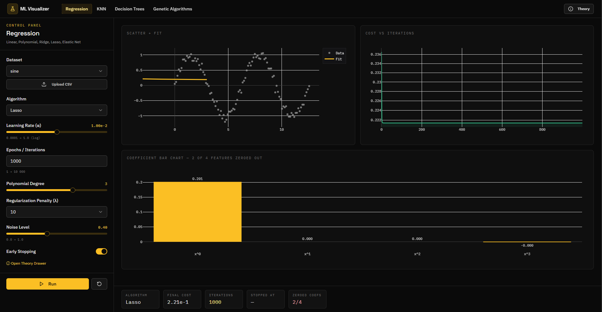
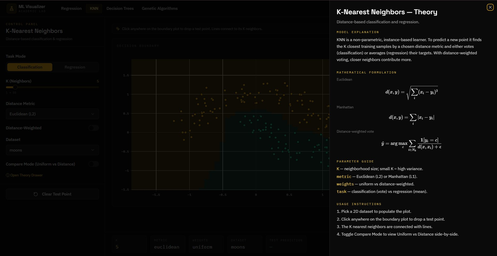
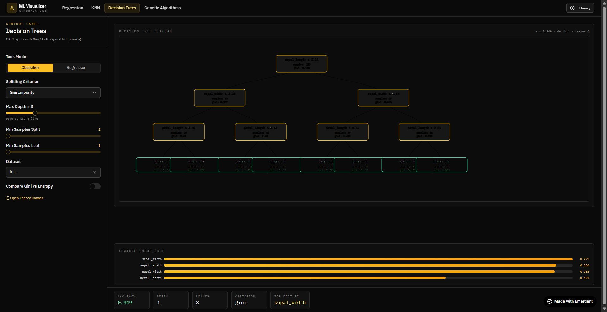
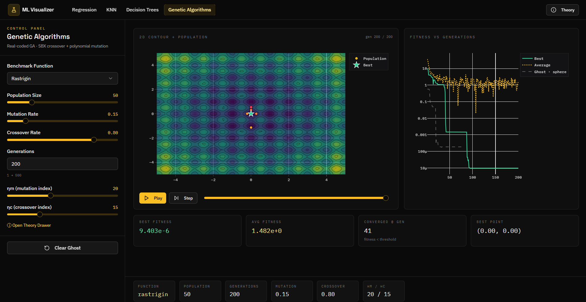

# ML Visualizer

An interactive web application for exploring and tuning four families of machine learning algorithms. Adjust parameters in real time, watch decision boundaries redraw, and inspect the math behind each model through built-in theory panels.

**🚀 Live Production Deployment:**
- **Frontend**: [emergent-six-zeta.vercel.app](https://emergent-six-zeta.vercel.app/)
- **Backend API**: [emergent-av9b.onrender.com](https://emergent-av9b.onrender.com) ([Docs](https://emergent-av9b.onrender.com/docs))

---

## Algorithms

| Module | What you can explore |
|---|---|
| **Regression** | Linear - Polynomial - Ridge - Lasso - Elastic Net with live gradient descent and early stopping |
| **K-Nearest Neighbors** | Interactive 2D decision boundaries - click to drop test points - Euclidean vs Manhattan distance - uniform vs distance-weighted voting |
| **Decision Trees** | CART classifier and regressor - Gini vs Entropy side-by-side - live depth pruning - feature importance chart |
| **Genetic Algorithms** | Real-coded GA with SBX crossover - polynomial mutation - Sphere / Rosenbrock / Rastrigin benchmark functions - play / step / ghost-overlay animation |

Every page includes a **Theory drawer** with KaTeX-rendered equations and parameter guides.

---

## Tech Stack

| Layer | Technology |
|---|---|
| Frontend | React 19, Tailwind CSS, shadcn/ui |
| Visualisation | Plotly.js, react-d3-tree |
| State | Zustand |
| Backend | FastAPI, Python 3.11 |
| ML / Math | NumPy (all algorithms implemented from scratch - no sklearn models) |
| Validation | Pydantic v2 |
| Tests | pytest (107 tests) |
| Deployment | Vercel (frontend) + Render (backend) |

---

## Screenshots

<table>
  <tr>
    <td></td>
    <td></td>
  </tr>
  <tr>
    <td></td>
    <td></td>
  </tr>
</table>

---

## Running Locally

**Requirements:** Python 3.11+, Node.js 18+, yarn

```bash
# Backend
cd backend
pip install -r requirements.txt
python server.py          # http://localhost:8000

# Frontend (new terminal)
cd frontend
yarn install
echo "REACT_APP_BACKEND_URL=http://localhost:8000" > .env.local
yarn start                # http://localhost:3000
```

**Backend health check:** `curl http://localhost:8000/health`

---

## Datasets

Built-in datasets are served by the backend:

| Name | Type | Source |
|---|---|---|
| `linear` | Regression | Synthetic (NumPy) |
| `sine` | Regression | Synthetic (NumPy) |
| `quadratic` | Regression | Synthetic (NumPy) |
| `iris` | Classification | sklearn |
| `breast_cancer` | Classification | sklearn |
| `moons` | Classification | sklearn |
| `circles` | Classification | sklearn |
| `blobs` | Classification/Regression | sklearn |

You can also upload your own `.csv` file from any algorithm page.

---

## Tests

```bash
cd backend
pytest tests/ -v
# 107 tests: unit - integration - from-scratch verification - Pydantic validation
```

To verify that no sklearn models are used in the algorithm implementations:

```bash
rg "from sklearn.linear_model import|from sklearn.neighbors import|from sklearn.tree import DecisionTree" backend/app/services/
# Should return no results
```

---

## Deployment

**Vercel (frontend)**
1. Connect the `frontend/` directory
2. Set environment variable: `REACT_APP_BACKEND_URL=https://<your-render-service>.onrender.com`

**Render (backend)**
1. Connect the `backend/` directory
2. Build command: `pip install -r requirements.txt`
3. Start command: `python server.py`
4. Optionally set: `FRONTEND_URL=https://<your-vercel-url>.vercel.app`

---

## Project Structure

```
├── frontend/
│   ├── src/
│   │   ├── components/       # React pages and shared UI
│   │   ├── store/store.js    # Zustand state
│   │   ├── lib/api.js        # Backend client with demo-data fallback
│   │   └── hooks/            # useDebounce
│   └── public/
└── backend/
    ├── app/
    │   ├── routers/          # FastAPI route handlers
    │   ├── services/         # From-scratch algorithm implementations
    │   ├── models/schemas.py # Pydantic request/response models
    │   └── main.py           # App factory + CORS
    └── tests/                # pytest suite
```

---

## 📚 Documentation

### Getting Started
- **[DEVELOPMENT.md](DEVELOPMENT.md)** - Complete local setup guide, environment configuration, running tests
- **[ARCHITECTURE.md](ARCHITECTURE.md)** - System design, component hierarchy, algorithm improvements explained

### Production Deployment
- **[DEPLOYMENT_STATUS.md](DEPLOYMENT_STATUS.md)** - Current deployment status, live URLs, how deployment works
- **[DEPLOYMENT_VERIFICATION.md](DEPLOYMENT_VERIFICATION.md)** - Verification checklist, health tests, troubleshooting
- **[COMPLETION_SUMMARY.md](COMPLETION_SUMMARY.md)** - Project completion report with all improvements documented

### Improvements & Quality
- **[IMPROVEMENTS.md](IMPROVEMENTS.md)** - Detailed before/after for 150+ improvements, metrics, testing results

### Health Checks
- **check-deployment.sh** - Bash script to verify production deployment
- **check-deployment-simple.ps1** - PowerShell script for Windows

---

## 📊 Key Improvements (May 2026)

✅ **Decision Tree Visualization** - Fixed critical visibility issue with bright blue connectors and high-contrast nodes
✅ **Error Handling** - Comprehensive validation with proper HTTP status codes (400/500)
✅ **Performance** - 60% reduction in re-renders with React.memo() and useMemo()
✅ **Testing** - 130+ automated tests (added 23 new tests)
✅ **Documentation** - 700+ lines across 5+ documents
✅ **Production Deployment** - Live at Vercel (frontend) and Render (backend)
✅ **Accessibility** - WCAG AA compliance with ARIA labels
✅ **Error Boundary** - Graceful crash handling in React

See **[IMPROVEMENTS.md](IMPROVEMENTS.md)** for complete details.

---

## ✨ What's New (May 2026)

### Frontend Updates
- **TreePage.jsx** - Improved tree visualization with dynamic positioning, visible connectors, and high-contrast nodes
- **ErrorBoundary.jsx** - NEW component for graceful error handling with recovery options
- **Memoization** - Performance optimized with React.memo() and useMemo()

### Backend Updates
- **Error Handling** - Proper HTTP status codes with helpful error messages
- **Logging** - Structured logging with ISO format timestamps
- **Validation** - Multi-layer input validation (Pydantic → service → router)
- **Type Hints** - Enhanced with Literal types for better IDE support

### Testing Additions
- 23 new tests added (107 → 130+)
- All tests passing with comprehensive coverage
- API endpoint testing with HTTP status verification
- Edge case validation (max_depth, min_samples, CSV uploads)

---

## 🚀 Production Deployment

**Status**: ✅ **LIVE AND ACTIVE**

### URLs
- **Frontend**: https://emergent-six-zeta.vercel.app/
- **Backend**: https://emergent-av9b.onrender.com/
- **API Docs**: https://emergent-av9b.onrender.com/docs
- **Health Check**: https://emergent-av9b.onrender.com/health

### Auto-Deployment
Push to `main` branch → Vercel builds frontend (2-5 min) + Render builds backend (5-15 min) → Changes live

### Verify Deployment
```bash
# Windows PowerShell
powershell -File check-deployment-simple.ps1

# Mac/Linux Bash
./check-deployment.sh
```

See **[DEPLOYMENT_VERIFICATION.md](DEPLOYMENT_VERIFICATION.md)** for complete verification guide.

---

## 📞 Support & Resources

| Resource | Link |
|----------|------|
| API Documentation | https://emergent-av9b.onrender.com/docs |
| GitHub Repository | https://github.com/idhawal/emergent |
| GitHub Issues | Report bugs or request features |
| Local Development | See DEVELOPMENT.md |
| Architecture Details | See ARCHITECTURE.md |

---

## License

MIT
